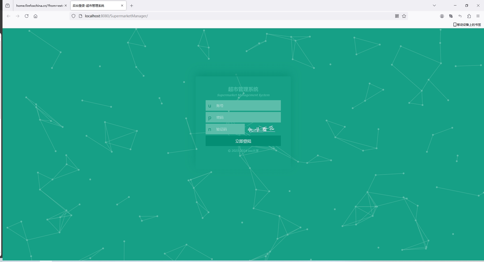
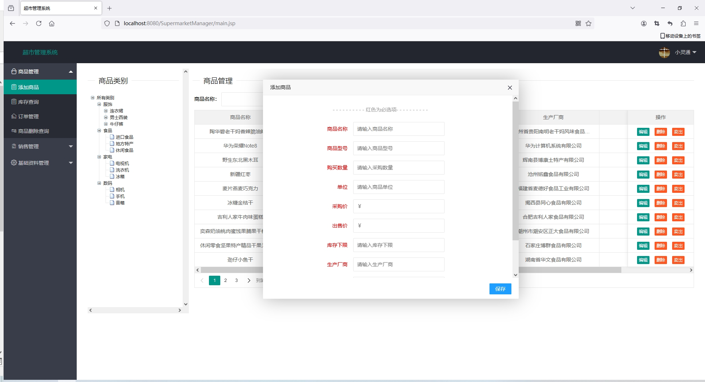
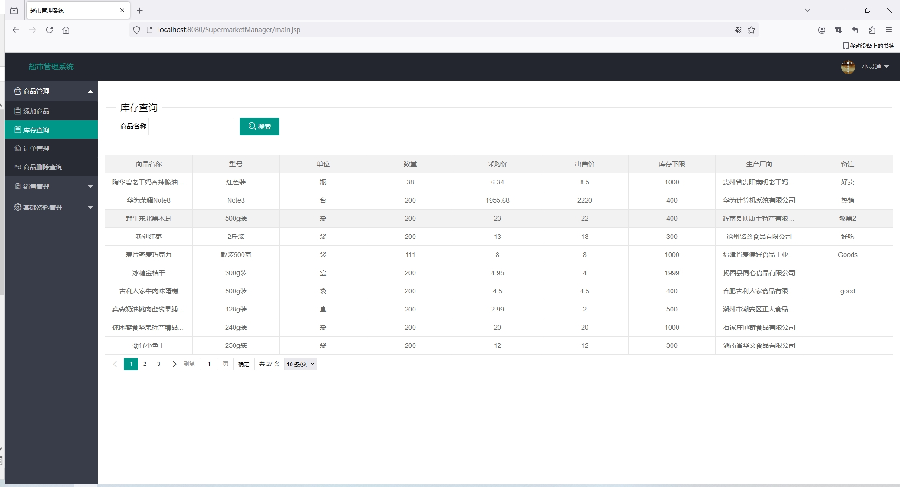
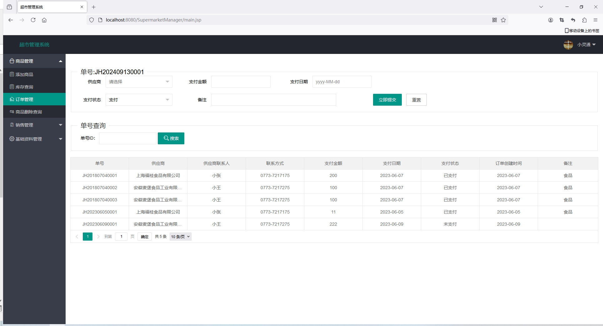
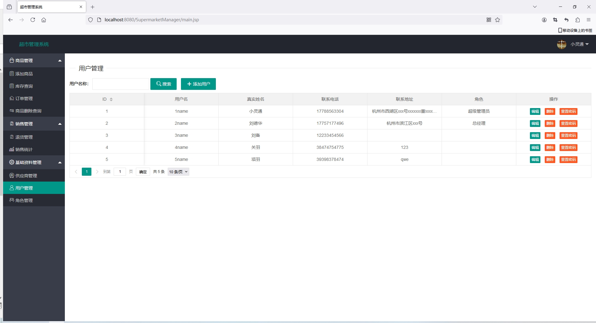

<h1 align="center">基于SSM框架的超市进销库存管理系统【带文档】</h1>

 获取sql文件 QQ: 3645296857 QQ群: 978300347 

<h4> 需要视频演示可联系上述QQ，私发视频链接 </h4>

 获取更多高质量源码，请访问：[mzoo源码网](https://mzoocodes.com/)

## 简介

> 本代码来源于网络,仅供学习参考使用!
>
> <b style="color: dodgerblue"> 提供1.远程部署/2.修改代码/3.定制程序/4.文档指导/5.框架代码讲解、技术解答、代码讲解等服务 </b>
>
> 前端地址：http://localhost:8080/SupermarketManager
>
> 管理员: 1name 密码: 1234
>
> 总经理：2name 密码：2
> 
> 店长：3name 密码：3
> 
> 财务：4name 密码：4
> 
> 采购：5name 密码：5
> 
> 员工：6name 密码：6

## 项目介绍

基于SSM框架的超市进销库存管理系统【带文档】：前端 JSP，后端 SpringMvc、Mybatis，系统角色分为：管理员、总经理、店长、财务、采购和员工，管理员在管理后台物品信息，对物品种类进行管理等。主要功能如下：

### 管理员：

- 基本操作：登录、修改密码、获取个人信息、修改个人信息
- 系统用户管理：当点击“用户管理”这一菜单的时候，会出现管理员+员工两个子菜单，可以对这两个模块进行增删改查操作
- 更多块管理：当点击“更多模块”这一菜单的时候，会出现分类信息+商品信息管理+商品销售+商品进货+客户管理+商品利润+供应商管理+通知公告这六个子菜单，可以对分这六个模块进行增删改查操作
- 商品信息管理：管理员可以对小型超市管理系统 中现有的商品信息进行增删改查
- 商品销售管理：管理员可以对小型超市管理系统 中现有的商品销售信息进行增删改查
- 客户信息管理：管理员可以对小型超市管理系统 中现有的客户信息进行增删改查
- 供应商管理：管理员对供应商进行管控

### 其他身份

- 登录：员工登录小型超市管理系统；用户对个人信息的增删改查，比如个人资料，密码修改
- 商品信息管理：员工进行商品信息的阅览，查看管理者发布的商品信息。
- 商品销售：进行商品销售查询，查看管理者发布的商品销售信息

## 环境

- <b>IntelliJ IDEA 2020.3</b>

- <b>Mysql 5.7.26</b>

- <b>Tomcat 7.0.108</b>

- <b>Maven 3.6.3</b>

- <b>JDK 1.8</b>

## 运行截图

